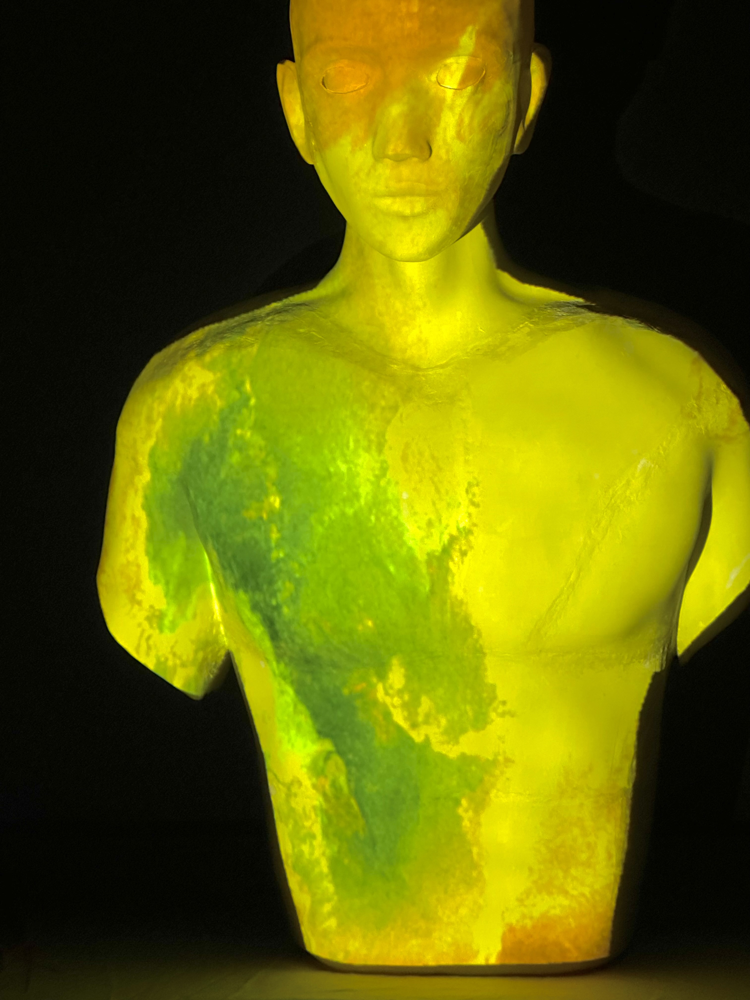

<body>
  

  
</body>

<!-- Using HTML to center the abstract -->

  

    <h2>Abstract</h2>
    

      Smartphone cameras are ubiquitous in daily life, yet their performance can be severely impacted by dirty lenses, leading to degraded image quality. This issue is often overlooked in image restoration research, which assumes ideal or controlled lens conditions. To address this gap, we introduced SIDL (Smartphone Images with Dirty Lenses), a novel dataset designed to restore images captured through contaminated smartphone lenses. SIDL contains diverse real-world images taken under various lighting conditions and environments. These images feature a wide range of lens contaminants, including water drops, fingerprints, and dust. Each contaminated image is paired with a clean reference image, enabling supervised learning approaches for restoration tasks. To evaluate the challenge posed by SIDL, various state-of-the-art restoration models were trained and compared on this dataset. Their performances achieved some level of restoration but did not adequately address the diverse and realistic nature of the lens contaminants in SIDL. This challenge highlights the need for more robust and adaptable image restoration techniques for restoring images with dirty lenses.
    

  

