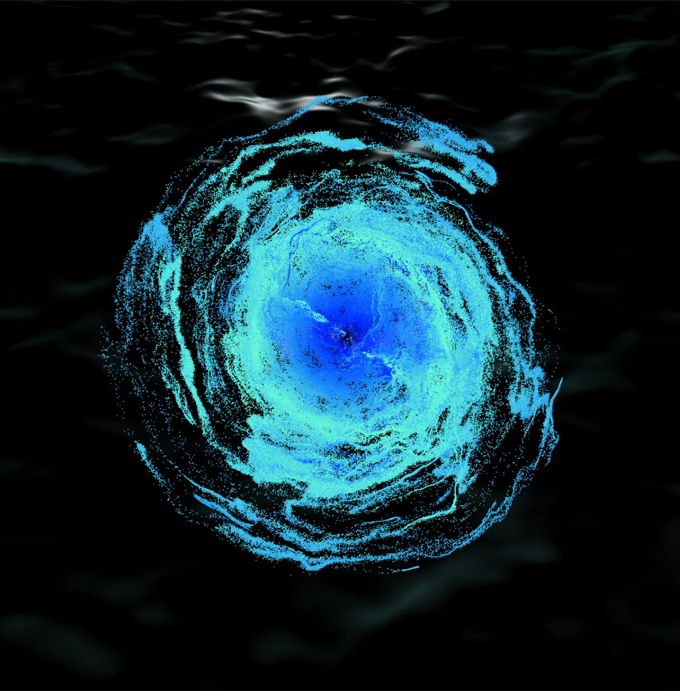

# Hello, Stranger

[Team.Ink](http://Team.Ink)  
글로벌미디어학부 2025 졸업전시

<!-- 사진을 나란히 배치하기 위해 HTML flex 컨테이너 사용 -->

## 작품 소개

Hello, Stranger는 낯선 이가 건네는 소리와 색을 통해 개인의 경험과 감성을 일깨우는 미디어아트입니다.  
낯선 이와의 눈맞춤 속, 관람객이 **느끼는 모든 것이 작품의 의미**가 되는 경험을 선사합니다.  
이 공간에는 수많은 사람들의 기억과 감정이 그대로 남아 스며듭니다.

## 기술 스택

- Touch Designer  
- Maya  
- Arduino  

## 팀원 소개

| 이름   | 역할        | 연락처                                |
| ------ | --------- | ------------------------------------- |
| 최수영 | 기획, 개발 | [csy010921@naver.com](mailto:csy010921@naver.com) |
| 곽윤희 | 기획, 디자인 | —                                     |
| 조연정 | 기획, 디자인 | [misodul0826@naver.com](mailto:misodul0826@naver.com) |
