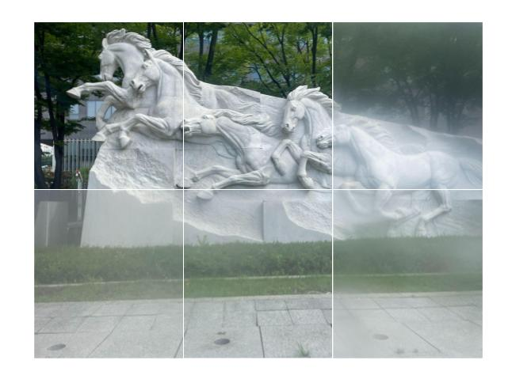

<body>
  

  
</body>

<!-- Using HTML to center the abstract -->

  

    <h2>Abstract</h2>
    

      Smartphone cameras are ubiquitous in daily life, yet their performance can be severely impacted by dirty lenses, leading to degraded image quality. This issue is often overlooked in image restoration research, which assumes ideal or controlled lens conditions. To address this gap, we introduced SIDL (Smartphone Images with Dirty Lenses), a novel dataset designed to restore images captured through contaminated smartphone lenses. SIDL contains diverse real-world images taken under various lighting conditions and environments. These images feature a wide range of lens contaminants, including water drops, fingerprints, and dust. Each contaminated image is paired with a clean reference image, enabling supervised learning approaches for restoration tasks. To evaluate the challenge posed by SIDL, various state-of-the-art restoration models were trained and compared on this dataset. Their performances achieved some level of restoration but did not adequately address the diverse and realistic nature of the lens contaminants in SIDL. This challenge highlights the need for more robust and adaptable image restoration techniques for restoring images with dirty lenses.
    

  

<!-- Dataset Download Buttons -->

## SIDL Dataset 
We provide 80% of the scenes for training and learning. The remaining scenes are used for online evaluation.
### Patchify images (512x512)
For efficient training and learning, we provide patchified images. 

  <a class="button is-primary" href="https://drive.google.com/file/d/1es3rPo5Y9O96EjDVXanUY8NpaRprWH-h/view?usp=sharing" target="_blank">Train</a>
  <a class="button is-primary" href="https://drive.google.com/file/d/1u5-MDauO3XolXsU6eOARwlXo7SnpLwqA/view?usp=sharing" target="_blank">Validation</a>
  <a class="button is-primary" href="https://drive.google.com/file/d/1-SFyyjH0G3C68OfDjZ_O7M4mOqkcJdEf/view?usp=sharing" target="_blank">Test</a>

### Full-resolution images (4032x3024)

  <a class="button is-primary" href="https://drive.google.com/file/d/1s_gUw1DCqokihl3YtO3lu9_GnLZaSElI/view?usp=sharing" target="_blank">Train</a>
  <a class="button is-primary" href="https://drive.google.com/file/d/1OHxG8Jh0goKIhkJTe9NXZ6uIuD5qVaNH/view?usp=sharing" target="_blank">Validation</a>

### RAW files
We also provide RAW image files (DNG) along with metadata.

  <a class="button is-primary" href="https://drive.google.com/file/d/1k78IIsUl2eYPnPvWkBampU0qlMrW4F-u/view?usp=sharing" target="_blank">DNG images</a>
  <a class="button is-primary" href="https://drive.google.com/file/d/1lAab5F3jjCByY4OEvGSAfykyAqp2wfTi/view?usp=sharing" target="_blank">Metadata</a>

### Online Evaluation  

  <a class="button is-primary" href="http://203.253.25.170:8080" target="_blank">Click here to launch evaluation</a>

  
Click the button above to evaluate your model on the SIDL benchmark.

### ISP pipeline
Coming soon

### Citation
<pre><code class="language-bibtex">
@inproceedings{choi2025sidl,
  title     = {SIDL: A Real-World Dataset for Restoring Smartphone Images with Dirty Lenses},
  author    = {Choi, Sooyoung and Park, Sungyong and Kim, Heewon},
  booktitle = {Proceedings of the AAAI Conference on Artificial Intelligence},
  volume    = {39},
  number    = {3},
  pages     = {2545--2554},
  year      = {2025}
}
</code></pre>

